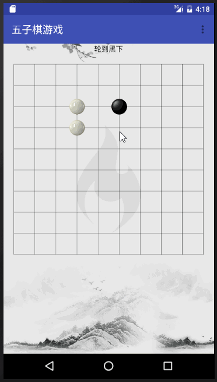
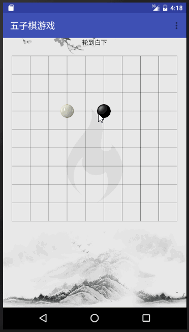

#一个简单的五子棋游戏

##添加了两个接口
###OnWhoPlayChessListener
这个接口是`显示下一步到哪一个棋`

###OnGameOverListener
游戏结束回调,`赢`OR`和`

##实现自定义属性的提取
attr.xml
```xml
 <attr name="firstPlay" format="boolean"/>
    <attr name="chessBoardLineCount" format="integer"/>
    <attr name="chessCount" format="integer"/>
    <attr name="whiteRes" format="reference"/>
    <attr name="blackRes" format="reference"/>
    <attr name="lineColor" format="color|reference"/>
    <attr name="lineSize" format="dimension|reference"/>

    <declare-styleable name="WuZiQiPanel">
        <!--先下手的那个是谁,true=白先下. false =黑先下 -->
        <attr name="firstPlay"/>
        <!--总共有多少条线,是10*10还是6*6的格子-->
        <attr name="chessBoardLineCount"/>
        <!--是5子棋,还是4子棋,还6子棋-->
        <attr name="chessCount"/>
        <!--重新设置白棋的图片-->
        <attr name="whiteRes"/>
        <!--重新设置黑子的图片-->
        <attr name="blackRes"/>
        <!--线的颜色-->
        <attr name="lineColor"/>
        <!--线的大小-->
        <attr name="lineSize"/>
    </declare-styleable>
```

##添加悔棋

##图片



## 添加WEB版五子棋
### 地址:[http://web.gson8.com/WebWuZiGame/index.html](http://web.gson8.com/WebWuZiGame/index.html)